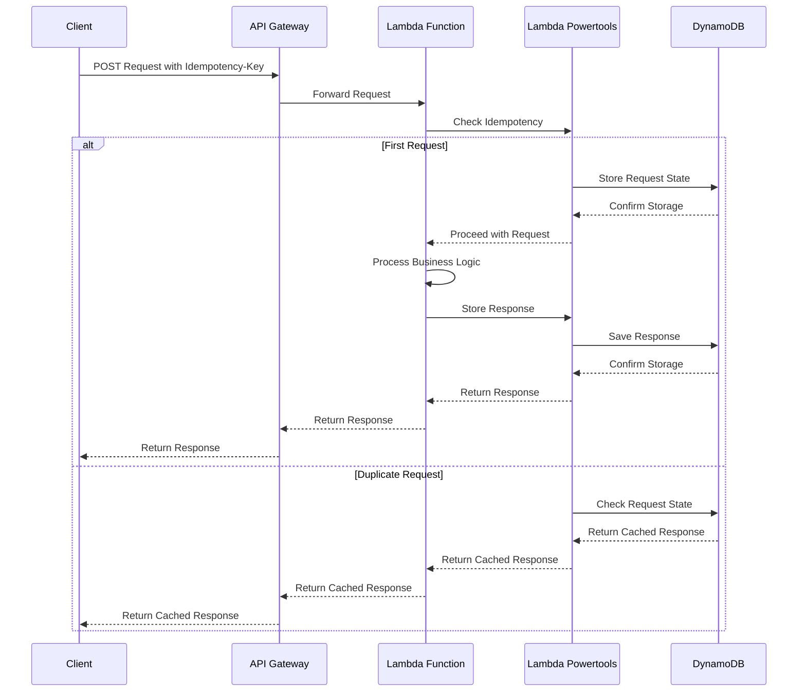

# Backend Flow Diagram

This diagram illustrates the flow of an idempotent request through the backend system.

```mermaid
sequenceDiagram
    participant Client
    participant API as API Gateway
    participant Lambda as Lambda Function
    participant Powertools as Lambda Powertools
    participant DynamoDB

    Client->>API: POST Request with Idempotency-Key
    API->>Lambda: Forward Request
    Lambda->>Powertools: Check Idempotency
    
    alt First Request
        Powertools->>DynamoDB: Store Request State
        DynamoDB-->>Powertools: Confirm Storage
        Powertools-->>Lambda: Proceed with Request
        Lambda->>Lambda: Process Business Logic
        Lambda->>Powertools: Store Response
        Powertools->>DynamoDB: Save Response
        DynamoDB-->>Powertools: Confirm Storage
        Powertools-->>Lambda: Return Response
        Lambda-->>API: Return Response
        API-->>Client: Return Response
    else Duplicate Request
        Powertools->>DynamoDB: Check Request State
        DynamoDB-->>Powertools: Return Cached Response
        Powertools-->>Lambda: Return Cached Response
        Lambda-->>API: Return Cached Response
        API-->>Client: Return Cached Response
    end
``` 