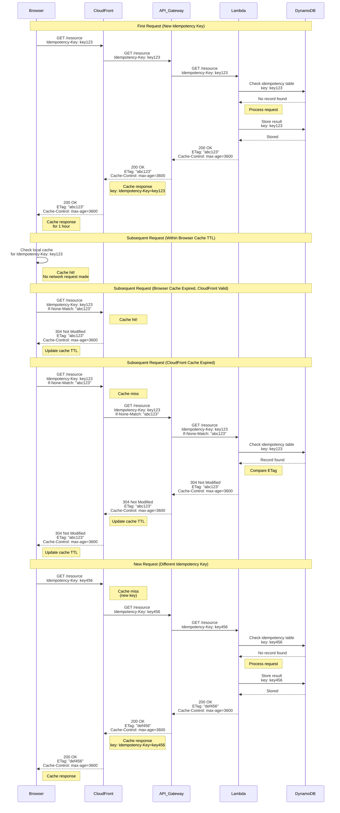

## Cache flow

```mermaid
sequenceDiagram
    participant Browser
    participant CloudFront
    participant API_Gateway
    participant Lambda
    participant DynamoDB

    %% First Request Flow
    Note over Browser,DynamoDB: First Request (New Idempotency Key)
    Browser->>CloudFront: GET /resource<br/>Idempotency-Key: key123
    CloudFront->>API_Gateway: GET /resource<br/>Idempotency-Key: key123
    API_Gateway->>Lambda: GET /resource<br/>Idempotency-Key: key123
    Lambda->>DynamoDB: Check idempotency table<br/>key: key123
    DynamoDB-->>Lambda: No record found
    Note right of Lambda: Process request
    Lambda->>DynamoDB: Store result<br/>key: key123
    DynamoDB-->>Lambda: Stored
    Lambda-->>API_Gateway: 200 OK<br/>ETag: "abc123"<br/>Cache-Control: max-age=3600
    API_Gateway-->>CloudFront: 200 OK<br/>ETag: "abc123"<br/>Cache-Control: max-age=3600
    Note right of CloudFront: Cache response<br/>key: Idempotency-Key=key123
    CloudFront-->>Browser: 200 OK<br/>ETag: "abc123"<br/>Cache-Control: max-age=3600
    Note right of Browser: Cache response<br/>for 1 hour

    %% Within Browser Cache TTL
    Note over Browser,DynamoDB: Subsequent Request (Within Browser Cache TTL)
    Browser->>Browser: Check local cache<br/>for Idempotency-Key: key123
    Note right of Browser: Cache hit!<br/>No network request made

    %% After Browser Cache Expires but CloudFront has it
    Note over Browser,DynamoDB: Subsequent Request (Browser Cache Expired, CloudFront Valid)
    Browser->>CloudFront: GET /resource<br/>Idempotency-Key: key123<br/>If-None-Match: "abc123"
    Note right of CloudFront: Cache hit!
    CloudFront-->>Browser: 304 Not Modified<br/>ETag: "abc123"<br/>Cache-Control: max-age=3600
    Note right of Browser: Update cache TTL

    %% After CloudFront Cache Expires
    Note over Browser,DynamoDB: Subsequent Request (CloudFront Cache Expired)
    Browser->>CloudFront: GET /resource<br/>Idempotency-Key: key123<br/>If-None-Match: "abc123"
    Note right of CloudFront: Cache miss
    CloudFront->>API_Gateway: GET /resource<br/>Idempotency-Key: key123<br/>If-None-Match: "abc123"
    API_Gateway->>Lambda: GET /resource<br/>Idempotency-Key: key123<br/>If-None-Match: "abc123"
    Lambda->>DynamoDB: Check idempotency table<br/>key: key123
    DynamoDB-->>Lambda: Record found
    Note right of Lambda: Compare ETag
    Lambda-->>API_Gateway: 304 Not Modified<br/>ETag: "abc123"<br/>Cache-Control: max-age=3600
    API_Gateway-->>CloudFront: 304 Not Modified<br/>ETag: "abc123"<br/>Cache-Control: max-age=3600
    Note right of CloudFront: Update cache TTL
    CloudFront-->>Browser: 304 Not Modified<br/>ETag: "abc123"<br/>Cache-Control: max-age=3600
    Note right of Browser: Update cache TTL

    %% New Idempotency Key
    Note over Browser,DynamoDB: New Request (Different Idempotency Key)
    Browser->>CloudFront: GET /resource<br/>Idempotency-Key: key456
    Note right of CloudFront: Cache miss<br/>(new key)
    CloudFront->>API_Gateway: GET /resource<br/>Idempotency-Key: key456
    API_Gateway->>Lambda: GET /resource<br/>Idempotency-Key: key456
    Lambda->>DynamoDB: Check idempotency table<br/>key: key456
    DynamoDB-->>Lambda: No record found
    Note right of Lambda: Process request
    Lambda->>DynamoDB: Store result<br/>key: key456
    DynamoDB-->>Lambda: Stored
    Lambda-->>API_Gateway: 200 OK<br/>ETag: "def456"<br/>Cache-Control: max-age=3600
    API_Gateway-->>CloudFront: 200 OK<br/>ETag: "def456"<br/>Cache-Control: max-age=3600
    Note right of CloudFront: Cache response<br/>key: Idempotency-Key=key456
    CloudFront-->>Browser: 200 OK<br/>ETag: "def456"<br/>Cache-Control: max-age=3600
    Note right of Browser: Cache response
```