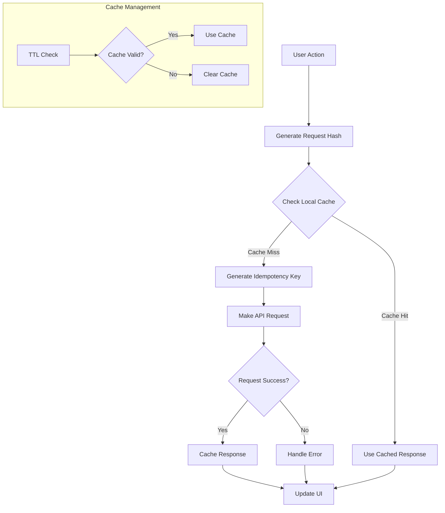

# Frontend Flow Diagram

This diagram illustrates how the frontend handles idempotent requests and caching.

```mermaid
graph TD
    A["User Action"] --> B["Generate Request Hash"]
    B --> C{"Check Local Cache"}
    
    C -->|Cache Hit| D["Use Cached Response"]
    C -->|Cache Miss| E["Generate Idempotency Key"]
    
    E --> F["Make API Request"]
    F --> G{"Request Success?"}
    
    G -->|Yes| H["Cache Response"]
    G -->|No| I["Handle Error"]
    
    H --> J["Update UI"]
    I --> J
    
    D --> J
    
    subgraph "Cache Management"
        K["TTL Check"] --> L{"Cache Valid?"}
        L -->|Yes| M["Use Cache"]
        L -->|No| N["Clear Cache"]
    end
``` 